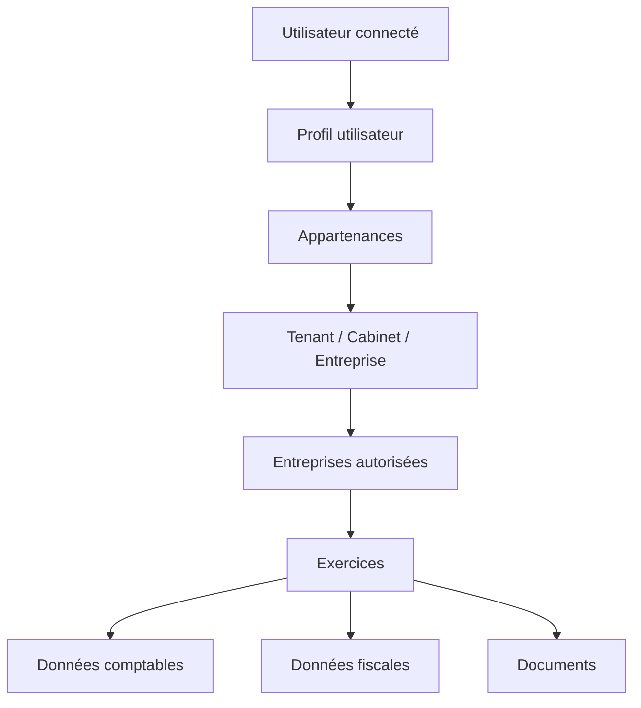

# Page de contrôle du document

| Élément | Description |
|---|---|
| Nom du projet | SaaS comptable OHADA pour entreprises camerounaises |
| Version du cahier des charges | 1.1 |
| Date | 2026-05-28 |
| Évolutions depuis la 1.0 | Vérification de faisabilité et corrections factuelles : stratégie de paiement adaptée au Cameroun, sécurité du stockage, durcissement du RLS multi-tenant, justesse comptable (types monétaires, numérotation concurrente, idempotence), compléments métier camerounais, recadrage du périmètre MVP et du calendrier |
| Porteur du besoin | Nathan OBIANG TIME |
| Cible | PME, TPE, entreprises individuelles, associations, OBNL, cabinets comptables et structures multi-sites au Cameroun |
| Référentiel comptable | Acte uniforme OHADA relatif au droit comptable et à l'information financière, SYSCOHADA révisé |
| Cadre fiscal | Fiscalité camerounaise, DGI, télédéclaration, DSF, obligations déclaratives et paramétrage annuel des règles fiscales |
| Plateforme de développement visée | Lovable.dev, avec architecture recommandée React, Tailwind CSS, Supabase/PostgreSQL, RLS, Edge Functions et intégrations de paiement |

> Note importante : ce cahier des charges est un document de conception et de développement. Les règles fiscales, taux, seuils, modèles de déclarations et modalités de dépôt doivent être validés chaque année avec les textes officiels en vigueur, la DGI, la loi de finances applicable et, si nécessaire, un conseil fiscal qualifié. Le logiciel doit donc intégrer un moteur de paramétrage fiscal versionné et non des taux codés définitivement.

# Résumé exécutif

Le projet vise à créer un SaaS comptable professionnel, multi-entreprises et multi-utilisateurs, destiné au marché camerounais et aligné sur le système comptable OHADA. Il doit permettre à différents types d'organisations de tenir une comptabilité régulière, de suivre leurs ventes, achats, banques, caisses, stocks, immobilisations, déclarations fiscales, états financiers et obligations de fin d'exercice.

La solution doit être suffisamment modulable pour servir à la fois :

- une petite entreprise qui souhaite simplement suivre ses opérations, sa caisse, sa banque et produire des états de base ;
- une PME soumise à une comptabilité plus structurée, avec journaux, immobilisations, TVA, déclarations périodiques et états financiers ;
- un cabinet comptable qui gère plusieurs dossiers clients ;
- une association ou un organisme à but non lucratif qui doit produire une DSF adaptée ;
- une entreprise multisite avec agences, caisses, stocks et plusieurs profils utilisateurs.

Le SaaS doit être construit selon une architecture multi-tenant stricte : chaque entreprise cliente dispose d'un espace isolé, de ses utilisateurs, de ses exercices, de ses pièces, de ses écritures, de ses documents, de ses paramètres fiscaux et de ses abonnements. L'isolation des données est un point critique, car les informations comptables et fiscales sont sensibles.

Le référentiel comptable de base est le SYSCOHADA révisé. L'OHADA précise que l'Acte uniforme relatif au droit comptable et à l'information financière a été adopté le 26 janvier 2017, avec une entrée en vigueur pour les comptes personnels des entités au 1er janvier 2018 ; le SYSCOHADA révisé comprend le plan comptable général OHADA ainsi que le dispositif des comptes consolidés et combinés.[^ohada_audcif] Au Cameroun, la DGI indique que la loi de finances 2019 a consacré l'entrée en vigueur du référentiel AUDCIF-SYSCOHADA pour les DSF et que les DSF sont présentées conformément au SYSCOHADA révisé.[^dgi_dsf]

Du côté fiscal, le logiciel doit suivre la logique des téléprocédures camerounaises. La DGI met à disposition des services de télédéclaration, d'immatriculation, de DSF, d'OTP/e-billing, de bénéficiaires effectifs, de documents fiscaux et de déclaration pré-remplie.[^dgi_teleservices] Le guide de transmission électronique des DSF 2026 mentionne notamment le NIU, l'identification du type de DSF selon l'activité et le régime fiscal, la connexion au site des impôts, le choix de l'année, la création d'une nouvelle DSF, le téléversement des fichiers et les modes de paiement possibles.[^guide_dsf_2026]

Le développement sur Lovable doit être piloté par prompts progressifs. Lovable se présente comme une plateforme full-stack permettant de générer des applications web à partir de langage naturel, avec frontend, backend, base de données, authentification et intégrations.[^lovable_welcome] La documentation Lovable recommande une séparation claire entre frontend public, Edge Functions côté serveur et base PostgreSQL avec Row Level Security pour protéger les données.[^lovable_security_best_practices] Cette architecture est adaptée au présent projet.

# Objectifs du projet

## Objectif général

Créer une plateforme SaaS de comptabilité, fiscalité et gestion financière permettant aux entreprises camerounaises de produire une comptabilité conforme au référentiel OHADA, de suivre leurs obligations fiscales, de piloter leurs activités et de collaborer avec leurs comptables, fiscalistes et dirigeants.

## Objectifs spécifiques

1. Permettre la création et la gestion de plusieurs entreprises clientes dans une même application.
2. Assurer l'isolation stricte des données par entreprise, cabinet, utilisateur, exercice et rôle.
3. Fournir un plan comptable OHADA paramétrable, extensible et adapté à chaque type d'activité.
4. Gérer les écritures comptables selon le principe de la partie double.
5. Produire les principaux états comptables : balance, grand livre, journal, bilan, compte de résultat, tableaux de synthèse.
6. Préparer les données nécessaires aux déclarations fiscales et à la DSF.
7. Gérer les abonnements mensuels, annuels, essais gratuits, renouvellements, suspensions et changements de formule.
8. Offrir des modules activables selon les catégories d'abonnement.
9. Donner aux cabinets comptables la possibilité de gérer plusieurs dossiers clients depuis un espace unique.
10. Prévoir une base technique compatible avec une évolution vers l'API DSF, les fichiers Excel DGI et les intégrations de paiement.

## Résultats attendus

Le produit final doit permettre :

- à une entreprise de créer son compte, renseigner son profil fiscal et comptable, configurer son exercice, importer ou utiliser le plan comptable OHADA ;
- à un comptable de saisir ou importer les écritures comptables ;
- à un dirigeant de suivre son tableau de bord financier ;
- à un fiscaliste de préparer les déclarations, contrôler les anomalies et documenter les dossiers ;
- à un administrateur SaaS de gérer les offres, abonnements, factures SaaS, paiements et support client ;
- à un cabinet d'expertise comptable de gérer plusieurs entreprises clientes avec des accès différenciés.

# Fondements réglementaires et sources de conception

## Référentiel comptable OHADA

Le logiciel doit reposer sur le SYSCOHADA révisé. Les fonctionnalités de comptabilité doivent être conçues autour des principes suivants :

- tenue régulière et structurée de la comptabilité ;
- plan de comptes conforme au plan comptable OHADA ;
- journaux comptables ;
- pièces justificatives ;
- écritures équilibrées ;
- états financiers de synthèse ;
- archivage et traçabilité ;
- adaptation selon la taille et le régime de l'entité.

Le plan comptable doit être livré sous forme de référentiel de base, mais chaque entreprise doit pouvoir créer des sous-comptes adaptés à ses besoins. Le système doit empêcher toute modification destructrice du référentiel après utilisation d'un compte dans une écriture validée.

## DSF et téléprocédures camerounaises

La DGI précise que les formats de DSF de droit commun en vigueur comprennent notamment la DSF du système normal et la DSF du système minimal de trésorerie, et que ces DSF comportent des tableaux d'informations générales, des états financiers avec notes annexes et des tableaux fiscaux.[^dgi_dsf]

Le logiciel doit donc prévoir :

- un module de préparation DSF ;
- une cartographie entre les comptes OHADA et les rubriques DSF ;
- une production des états financiers nécessaires ;
- une préparation des annexes et tableaux fiscaux ;
- une exportation vers Excel lorsque le format DGI est requis ;
- une architecture permettant une future intégration API lorsque les spécifications officielles et l'accès sont disponibles.

Le guide DSF 2025 de la DGI indique trois procédés de soumission : téléversement du fichier Excel au format DGI pour les systèmes comptables non web-based, saisie directe dans l'interface, ou API pour les systèmes comptables web-based.[^guide_dsf_2025] Cela justifie une architecture capable de produire à la fois des fichiers exportables et des flux structurés pour API.

## Fiscalité camerounaise

Le logiciel ne doit pas coder les règles fiscales en dur. Il doit intégrer un moteur fiscal paramétrable par exercice fiscal, centre de rattachement, régime, type d'entreprise, périodicité, impôt, taux, seuil, formule, échéance, pénalité et justificatifs requis.

Les impôts, taxes et obligations à intégrer en modules configurables peuvent inclure, selon les cas :

- TVA ;
- acompte d'impôt sur les sociétés ou impôt minimum ;
- impôt sur les sociétés ;
- IRPP et retenues salariales ;
- retenues à la source ;
- précomptes ;
- patente ;
- licence ;
- taxe de développement local lorsque applicable ;
- contribution des patentes lorsque applicable ;
- droits d'enregistrement ;
- taxes locales ;
- obligations liées aux bénéficiaires effectifs ;
- autres obligations créées ou modifiées par les lois de finances.

La DGI publie des ressources telles que la circulaire de la loi de finances 2026, la charte du contribuable au 1er janvier 2026 et des guides de DSF.[^dgi_home] Le SaaS doit donc prévoir une console d'administration fiscale permettant de mettre à jour le paramétrage chaque année.

# Périmètre du projet

## Périmètre fonctionnel principal

Le projet couvre :

1. Gestion des comptes utilisateurs, rôles et droits.
2. Gestion multi-entreprises et multi-exercices.
3. Configuration comptable OHADA.
4. Saisie, importation, validation et lettrage des écritures.
5. Gestion des tiers : clients, fournisseurs, salariés, associés, administrations.
6. Facturation des ventes et suivi des encaissements.
7. Gestion des achats et dettes fournisseurs.
8. Trésorerie : banques, caisses, mobile money et rapprochements.
9. Stocks et inventaires, en option selon abonnement.
10. Immobilisations et amortissements.
11. Fiscalité et déclarations.
12. Préparation des états financiers et DSF.
13. Gestion documentaire.
14. Tableaux de bord et rapports.
15. Audit trail et journal des actions.
16. Abonnements SaaS et facturation des clients du SaaS.
17. Support, notifications et centre d'aide.
18. Administration globale de la plateforme.

## Périmètre non couvert en version initiale

Sauf décision contraire, la première version ne doit pas inclure :

- la certification officielle par l'administration fiscale ;
- le dépôt automatique de la DSF sans validation humaine ;
- la paie complète avec toutes les conventions collectives ;
- la consolidation de groupe complexe ;
- l'IFRS complet ;
- la gestion bancaire automatisée via agrégation bancaire, sauf connecteurs futurs ;
- une application mobile native ;
- la signature électronique juridiquement qualifiée ;
- l'archivage légal à valeur probante certifiée par un tiers de confiance.

Ces éléments doivent être prévus comme évolutions possibles.

# Cibles et personas

## Types d'organisations cibles

| Type d'organisation | Besoin principal | Modules prioritaires |
|---|---|---|
| Entreprise individuelle | Recettes, dépenses, caisse, banque, obligations fiscales simples | Comptabilité simplifiée, caisse, fiscalité, rapports |
| SARL ou PME commerciale | Comptabilité complète, ventes, achats, stocks, TVA, DSF | Comptabilité, facturation, achats, stocks, fiscalité, états financiers |
| Prestataire de services | Facturation, encaissements, charges, fiscalité | Facturation, trésorerie, fiscalité, reporting |
| Centre de santé ou clinique | Encaissements multiples, pharmacie, dépenses, stocks | Caisse, facturation, stocks, rapports, fiscalité |
| École privée | Scolarité, encaissements, dépenses, paie partielle | Facturation, caisse, banque, reporting, fiscalité |
| Association ou OBNL | Suivi des fonds, dépenses, projets, DSF OBNL | Comptabilité par fonds/projets, budget, DSF OBNL |
| Cabinet comptable | Gestion de plusieurs dossiers clients | Portail cabinet, multi-entreprises, collaboration, DSF, reporting |
| Entreprise multisite | Agences, caisses multiples, stocks par site | Multi-sites, stocks, rôles, tableaux consolidés |

## Personas

### Super administrateur SaaS

Responsable de la plateforme. Il configure les offres, les modules, les limites, les abonnements, les utilisateurs internes, les paramètres globaux, les notifications, les politiques de sécurité et le support.

### Administrateur d'entreprise

Représentant du client. Il crée l'entreprise, renseigne son profil, ajoute les utilisateurs, choisit l'offre, gère l'abonnement et attribue les rôles.

### Comptable interne

Il saisit les opérations, importe les pièces, contrôle les écritures, édite les rapports et prépare la clôture.

### Fiscaliste ou conseil externe

Il vérifie les déclarations, contrôle les anomalies fiscales, prépare les états et accompagne la DSF.

### Dirigeant

Il consulte les tableaux de bord, les soldes de caisse et banque, les ventes, les dépenses, les marges, les dettes, les créances et les alertes.

### Opérateur de caisse

Il enregistre les encaissements et décaissements autorisés, selon un périmètre limité.

### Auditeur ou contrôleur

Il accède en lecture aux écritures, pièces, journaux, justificatifs et pistes d'audit.

### Collaborateur de cabinet

Il gère un portefeuille de dossiers clients avec droits limités selon son niveau.

# Modèle économique et abonnements

## Principes généraux

Le SaaS doit fonctionner avec des abonnements modulaires :

- paiement mensuel ;
- paiement annuel ;
- essai gratuit éventuel ;
- réduction annuelle configurable ;
- formule par entreprise ;
- formule cabinet multi-dossiers ;
- options complémentaires activables ;
- limitation par volume d'écritures, utilisateurs, entreprises, stockage, modules et assistance.

## Catégories d'abonnement proposées

Les intitulés et prix seront paramétrables. Le cahier des charges propose les catégories suivantes.

| Offre | Cible | Limites indicatives | Modules inclus |
|---|---|---|---|
| Essentiel | Très petites structures | 1 entreprise, 2 utilisateurs, volume limité | Comptabilité de base, caisse, banque, rapports simples |
| Standard | PME | 1 entreprise, 5 utilisateurs, volume moyen | Essentiel + facturation, achats, taxes, pièces jointes |
| Professionnel | PME structurées | 1 entreprise, 10 utilisateurs, volume élevé | Standard + immobilisations, stocks, DSF, analyses avancées |
| Cabinet | Cabinets comptables | Plusieurs entreprises clientes | Portail cabinet, dossiers clients, collaboration, états et DSF |
| Entreprise | Grands comptes et multisites | Volumes personnalisés | Tous modules, SLA, support prioritaire, intégrations |

## Options facturables

- Module stock avancé.
- Module immobilisations avancé.
- Module paie et CNPS.
- Module budget analytique.
- Module multi-sites.
- Module API et intégrations.
- Stockage documentaire supplémentaire.
- Pack assistance DSF.
- Pack formation.
- Pack migration de données.

## Cycle de vie d'un abonnement

1. Création d'un compte.
2. Choix d'une formule.
3. Activation d'une période d'essai ou paiement immédiat.
4. Enregistrement du moyen de paiement.
5. Activation des modules selon l'offre.
6. Suivi de l'utilisation.
7. Notification avant expiration.
8. Renouvellement automatique ou manuel selon configuration.
9. Délai de grâce configurable.
10. Suspension progressive en cas de non-paiement.
11. Réactivation après paiement.
12. Archivage ou export des données en cas de résiliation.

## États d'abonnement

| État | Description | Effet sur l'application |
|---|---|---|
| trial | Période d'essai | Accès complet ou limité selon stratégie commerciale |
| active | Abonnement actif | Accès normal |
| past_due | Paiement en retard | Alertes, restrictions progressives |
| grace_period | Délai de grâce | Lecture et saisie limitées selon politique |
| suspended | Suspendu | Lecture seulement ou blocage selon politique |
| cancelled | Résilié | Accès limité à l'export et factures SaaS |
| archived | Archivé | Données conservées selon politique de rétention |

## Règles de suspension recommandées

- Ne jamais supprimer automatiquement les données comptables.
- Autoriser l'export des données même après résiliation pendant une période définie.
- Bloquer la création de nouvelles écritures en cas de suspension prolongée.
- Garder l'accès aux factures SaaS et justificatifs de paiement.
- Prévoir une procédure manuelle de réactivation par l'administrateur SaaS.

## Coûts d'exploitation à anticiper

Le modèle ne doit pas considérer que les seuls revenus. Pour que les offres soient viables, leur prix plancher doit couvrir au minimum : l'abonnement à la plateforme de développement Lovable ; un plan Supabase payant nécessaire aux sauvegardes et à la restauration à un instant donné ; un fournisseur d'e-mail transactionnel ; éventuellement un fournisseur SMS ; les frais des agrégateurs Mobile Money, de l'ordre de 1 à 4 % par transaction ; et le nom de domaine. Le certificat TLS est automatique sur Lovable.

# Architecture générale recommandée

## Architecture logique

L'application sera structurée autour de quatre couches :

1. Interface utilisateur web : React, TypeScript, Tailwind CSS, composants UI.
2. Couche métier côté serveur : Supabase Edge Functions ou fonctions backend Lovable Cloud.
3. Base de données : PostgreSQL avec Row Level Security.
4. Services externes : paiement, stockage, e-mail, SMS, export, API fiscale, support.

Lovable Cloud peut fournir un hébergement full-stack avec base, authentification, stockage, Edge Functions et services connexes.[^lovable_cloud] L'architecture doit toutefois rester exportable vers Supabase managé ou autre hébergement si nécessaire.

Principe architectural déterminant : dans une application Lovable, il n'existe aucune couche middleware ni passerelle d'API entre le frontend et la base. Les requêtes partent directement du navigateur vers le endpoint Supabase, et le code React compilé est servi par CDN. Trois conséquences à acter :

- Le Row Level Security est la seule barrière de sécurité sur les lectures et écritures directes. Rien ne peut être protégé en se reposant sur le fait que le frontend ne propose pas une action.
- Tout traitement qui doit rester inviolable — calcul fiscal officiel, attribution d'un numéro définitif, validation d'écriture, activation d'abonnement, génération d'URL signée, appel à un agrégateur de paiement — doit être placé dans une Edge Function côté serveur, jamais dans le client.
- Aucune clé secrète (clé service Supabase, clés d'agrégateur de paiement, clés e-mail ou SMS) ne doit figurer dans le bundle frontend ; elles vivent uniquement dans les secrets serveur des Edge Functions.

## Architecture multi-tenant

Le SaaS doit utiliser un modèle multi-tenant logique avec isolation par identifiant de tenant. Les tables sensibles doivent contenir au minimum :

- tenant_id ;
- company_id si la table concerne une entreprise ;
- fiscal_year_id si la donnée est liée à un exercice ;
- created_by ;
- updated_by ;
- timestamps ;
- status.

Les politiques RLS doivent interdire l'accès à toute ligne dont le tenant_id n'appartient pas à l'utilisateur connecté.

## Schéma d'isolation



Même si le diagramme Mermaid n'est pas rendu par tous les lecteurs Markdown, Lovable peut l'utiliser comme consigne d'architecture.

## Modules techniques

| Module technique | Rôle |
|---|---|
| Authentification | Connexion, inscription, réinitialisation, invitation, MFA optionnelle |
| Autorisations | Rôles, permissions, équipes, accès cabinet-client |
| Multi-tenancy | Isolation des entreprises et cabinets |
| Abonnements | Offres, limites, paiement, renouvellement, suspension |
| Moteur comptable | Journaux, écritures, contrôles, clôture |
| Moteur fiscal | Règles fiscales versionnées, échéances, déclarations |
| Reporting | États financiers, rapports de gestion, exports |
| Documents | Pièces jointes, classement, recherche |
| Audit | Traces, historisation, journal de sécurité |
| Administration | Paramètres globaux, supervision, support |

# Stack technique recommandée pour Lovable

## Frontend

- React.
- TypeScript.
- Tailwind CSS.
- shadcn/ui ou composants équivalents.
- React Hook Form pour les formulaires.
- Zod pour la validation côté client et côté serveur.
- Recharts pour les graphiques.
- TanStack Table pour les tableaux volumineux.
- i18n prêt pour français et anglais.

## Backend et base de données

- Supabase PostgreSQL ou Lovable Cloud basé sur Supabase.
- Row Level Security obligatoire.
- Edge Functions pour les traitements sensibles.
- Storage pour les pièces justificatives.
- Migrations SQL versionnées.
- Jobs planifiés pour notifications, relances, sauvegardes logiques et échéances.

La documentation Lovable indique que les applications doivent distinguer le frontend public, les Edge Functions côté serveur et la base PostgreSQL avec RLS pour imposer l'accès aux données.[^lovable_security_best_practices]

## Paiements

Point de réalité à intégrer dès la conception : Stripe n'est pas officiellement pris en charge au Cameroun. Une entreprise camerounaise ne peut pas y ouvrir de compte par la voie normale, les contournements documentés exigeant une entité ou un compte bancaire à l'étranger. Stripe ne peut donc pas être la solution d'encaissement principale du SaaS. Lovable documente certes l'ajout de paiements et d'abonnements via Stripe, Supabase Edge Functions, tables avec RLS et boutons d'interface[^lovable_stripe], mais cette intégration n'est utilisable ici qu'en mode bac à sable pour prototyper la mécanique d'abonnement, ou plus tard pour d'éventuels clients internationaux réglant par carte.

L'architecture doit prévoir une interface `PaymentProvider` abstraite. Cette décision reste valable ; seule la priorité des implémentations change. L'ordre recommandé est le suivant.

1. **Paiement manuel validé par administrateur (première implémentation).** Option à zéro dépendance technique : l'encaissement réel se fait hors application (Mobile Money, virement, espèces), puis l'administrateur active ou prolonge l'abonnement dans la console. Cela permet de vendre avant même d'avoir branché un agrégateur.
2. **Mobile Money via agrégateur local (priorité de production).** C'est le moyen de paiement dominant au Cameroun. Plusieurs agrégateurs exposent une API web intégrable depuis une Edge Function.
3. **Carte et international (optionnel, plus tard).** Stripe ou un agrégateur acceptant la carte, uniquement si une clientèle internationale le justifie.
4. **Virement et facture proforma annuelle.** Pour les clients institutionnels et les abonnements annuels.

Agrégateurs Mobile Money camerounais à considérer pour l'implémentation de production :

| Solution | Type | Couverture |
|---|---|---|
| CamPay | Agrégateur, guichet unique MoMo | MTN MoMo, Orange Money |
| Notch Pay | Agrégateur, API REST | Carte et Mobile Money |
| CinetPay | Agrégateur multi-pays Afrique | MoMo, carte, autres |
| Tranzak | Agrégateur | MoMo, carte |
| e-nkap / Smobilpay (Maviance) | Agrégateur multi-moyens | MoMo, espèces, carte |
| Monetbil | Facturation opérateur | MTN, Orange |
| API Orange Money Web Payment | Intégration directe opérateur | Orange Money |
| API MTN MoMo (Collection) | Intégration directe opérateur | MTN MoMo |

Exigences transverses pour tout moyen de paiement :

- L'appel à l'agrégateur, la vérification des confirmations et la modification de l'état d'abonnement se font exclusivement côté serveur, dans une Edge Function. Aucune clé d'API agrégateur côté frontend.
- Chaque transaction porte une clé d'idempotence afin que la réception multiple d'une même confirmation (webhook ou callback) n'active ou ne facture jamais deux fois.
- Les frais d'agrégateur, de l'ordre de 1 à 4 % par transaction plus parfois un frais fixe, sont intégrés au calcul de marge des offres.

## Services transverses

| Service | Recommandation |
|---|---|
| E-mail transactionnel | Brevo, Resend, SendGrid ou équivalent |
| SMS | Fournisseur local ou régional avec API |
| Stockage | Supabase Storage, avec buckets par tenant |
| Exports | PDF, Excel, CSV |
| Support | Ticketing interne au MVP, intégration externe plus tard |
| Monitoring | Logs applicatifs, erreurs frontend, audit sécurité |

# Exigences fonctionnelles détaillées

## Module 1 - Authentification et gestion des accès

### Objectif

Permettre à chaque utilisateur de se connecter de façon sécurisée et d'accéder uniquement aux entreprises, modules et actions autorisés.

### Fonctionnalités

- Inscription par e-mail.
- Connexion par e-mail et mot de passe.
- Réinitialisation de mot de passe.
- Invitation d'utilisateurs par e-mail.
- Acceptation d'invitation.
- Désactivation d'un utilisateur.
- Gestion des rôles.
- Gestion des permissions fines.
- Historique des connexions.
- Option future : MFA, SSO, magic link.

### Rôles minimum

| Rôle | Droits principaux |
|---|---|
| Super Admin SaaS | Accès total plateforme |
| Admin SaaS | Gestion commerciale, support, abonnements |
| Admin Entreprise | Paramètres de son entreprise, utilisateurs, abonnement |
| Chef Comptable | Validation, clôture, rapports complets |
| Comptable | Saisie, import, consultation comptable |
| Caissier | Opérations caisse limitées |
| Fiscaliste | Déclarations, contrôles fiscaux, DSF |
| Dirigeant | Tableaux de bord et rapports |
| Auditeur | Lecture seule, pièces, journaux, audit trail |
| Collaborateur Cabinet | Dossiers clients assignés |

### Critères d'acceptation

- Un utilisateur ne peut jamais voir les données d'une entreprise non autorisée.
- Un caissier ne peut pas valider une clôture comptable.
- Un auditeur ne peut pas modifier une écriture.
- Un utilisateur désactivé perd immédiatement son accès.
- Toute modification de rôle est historisée.

## Module 2 - Onboarding entreprise

### Objectif

Créer un parcours guidé permettant à une entreprise de paramétrer son dossier comptable et fiscal.

### Données à collecter

- Raison sociale.
- Nom commercial.
- Forme juridique.
- NIU.
- RCCM si applicable.
- Secteur d'activité.
- Adresse.
- Ville.
- Centre des impôts de rattachement.
- Régime fiscal, saisi comme valeur contrôlée parmi les régimes camerounais : impôt libératoire, régime simplifié, régime du réel, profil non lucratif/OBNL, ou autre profil sectoriel. Ce choix conditionne le type de DSF, les obligations déclaratives et les calculs ; il doit être confirmé chaque année avec les textes en vigueur.
- Type DSF pressenti.
- Devise principale : XAF par défaut.
- Date de début d'exercice.
- Date de fin d'exercice.
- Type de comptabilité : système normal, système minimal de trésorerie, OBNL, autre.
- Existence de TVA.
- Existence de retenues à la source.
- Option stock.
- Option immobilisations.
- Option paie.

### Parcours recommandé

1. Création du compte administrateur.
2. Choix de la formule.
3. Création de l'entreprise.
4. Sélection du profil comptable et fiscal.
5. Initialisation du plan comptable.
6. Création du premier exercice.
7. Import éventuel des soldes d'ouverture.
8. Invitation des utilisateurs.
9. Accès au tableau de bord.

### Critères d'acceptation

- Aucun dossier comptable ne peut être utilisé sans exercice ouvert.
- Le NIU doit être stocké comme identifiant fiscal principal.
- Le profil fiscal doit être versionné par exercice.
- Le système doit permettre de modifier certains paramètres avant la première validation comptable.

## Module 3 - Plan comptable OHADA

### Objectif

Fournir un plan comptable conforme au SYSCOHADA, personnalisable sans perdre la structure de référence.

### Fonctionnalités

- Import du plan comptable OHADA de base, fourni comme fichier de seed versionné dans le dépôt (`supabase/seed/ohada_chart.sql`) contenant les comptes du SYSCOHADA révisé, classes 1 à 8, avec numéro, libellé, classe, sens normal et nature. À la création d'une entreprise, ce référentiel est copié dans la table des comptes en y attachant `tenant_id` et `company_id`, afin que chaque entreprise crée ensuite ses sous-comptes sans modifier le référentiel commun.
- Création de sous-comptes.
- Activation/désactivation de comptes.
- Classification par classes, comptes, sous-comptes.
- Recherche rapide par numéro ou libellé.
- Liaison des comptes à des rubriques de reporting.
- Liaison des comptes à des rubriques DSF.
- Comptes favoris par type d'activité.
- Historique des modifications.

### Classes comptables à prévoir

| Classe | Usage général |
|---|---|
| Classe 1 | Ressources durables |
| Classe 2 | Actif immobilisé |
| Classe 3 | Stocks |
| Classe 4 | Tiers |
| Classe 5 | Trésorerie |
| Classe 6 | Charges des activités ordinaires |
| Classe 7 | Produits des activités ordinaires |
| Classe 8 | Autres charges et produits, comptes spéciaux selon référentiel |

### Règles métier

- Un compte utilisé dans une écriture validée ne peut pas être supprimé.
- Un compte peut être désactivé s'il n'est plus utilisé.
- Les comptes de tiers doivent permettre le lettrage.
- Les comptes de trésorerie doivent être associés à une banque, caisse ou wallet Mobile Money.
- Les comptes de TVA doivent être liés à une règle fiscale.

### Critères d'acceptation

- Le plan comptable de base est disponible à la création de l'entreprise.
- L'utilisateur peut créer un sous-compte sans altérer le référentiel général.
- La balance peut être regroupée par classes.
- Les comptes inactifs ne sont plus proposés en saisie.

## Module 4 - Exercices, périodes et clôtures

### Objectif

Gérer les exercices comptables, périodes mensuelles et clôtures.

### Fonctionnalités

- Création d'un exercice.
- Définition des périodes mensuelles.
- Ouverture et fermeture de périodes.
- Verrouillage d'une période.
- Réouverture contrôlée avec justification.
- Clôture annuelle.
- Génération des à-nouveaux.
- Archivage de l'exercice.
- Comparatifs N/N-1.

### États d'une période

| État | Description |
|---|---|
| ouverte | Saisie autorisée |
| en_revue | Saisie limitée, contrôle en cours |
| verrouillée | Modification interdite sauf réouverture autorisée |
| clôturée | Période finalisée |

### Critères d'acceptation

- Une écriture ne peut pas être créée dans une période verrouillée.
- Une réouverture exige un motif et une autorisation.
- La clôture annuelle est impossible si des écritures brouillard non validées existent.
- Les à-nouveaux sont générés dans le nouvel exercice avec traçabilité.

## Module 5 - Journaux et écritures comptables

### Objectif

Permettre la tenue comptable selon le principe de la partie double.

### Types de journaux

- Achats.
- Ventes.
- Banque.
- Caisse.
- Opérations diverses.
- Paie.
- Stocks.
- Immobilisations.
- Fiscalité.
- À-nouveaux.

### Fonctionnalités

- Création de journaux.
- Saisie d'écritures simples ou composées.
- Import CSV/Excel.
- Pièces jointes.
- Modèles d'écritures.
- Validation d'écritures.
- Annulation par contrepassation.
- Duplication d'écritures.
- Lettrage des comptes de tiers.
- Rapprochement bancaire.
- Numérotation automatique.
- Recherche et filtres.
- Export journal.

### Règles métier comptables

- Total débit égal total crédit.
- Une écriture validée n'est jamais supprimée physiquement.
- Toute correction se fait par modification tracée avant validation ou par contrepassation après validation.
- Une écriture doit appartenir à un journal, une période, un exercice et une entreprise.
- Une écriture doit avoir une date, un libellé, au moins deux lignes et une pièce ou référence.
- Les comptes utilisés doivent être actifs.
- Les montants doivent être positifs sur les lignes, avec sens débit/crédit.

### Statuts d'écriture

| Statut | Description |
|---|---|
| brouillon | Saisie en cours |
| à_valider | Prête pour revue |
| validée | Comptabilisée |
| rejetée | Refusée avec motif |
| contrepassée | Annulée par écriture inverse |

### Critères d'acceptation

- Le système bloque toute écriture déséquilibrée.
- Le système bloque les comptes inactifs.
- Le système bloque les périodes fermées.
- Le système garde un historique des changements.
- Une écriture validée conserve son numéro de manière définitive.

## Module 6 - Tiers : clients, fournisseurs et autres partenaires

### Objectif

Centraliser les informations sur les tiers et faciliter le suivi des créances, dettes, lettrages et déclarations.

### Types de tiers

- Client.
- Fournisseur.
- Salarié.
- Associé.
- Administration fiscale.
- CNPS.
- Banque.
- Bailleur.
- Partenaire.
- Autre.

### Données principales

- Nom ou raison sociale.
- Type.
- NIU si applicable.
- Adresse.
- Téléphone.
- E-mail.
- Compte comptable rattaché.
- Conditions de paiement.
- Plafond de crédit.
- Statut actif/inactif.
- Documents associés.

### Fonctionnalités

- Création et modification de tiers.
- Détection des doublons.
- Import CSV/Excel.
- Solde par tiers.
- Balance âgée clients.
- Balance âgée fournisseurs.
- Lettrage manuel et automatique.
- Historique des transactions.

### Critères d'acceptation

- Un tiers utilisé ne peut pas être supprimé.
- Les soldes clients et fournisseurs sont cohérents avec la comptabilité.
- Le lettrage partiel est possible.

## Module 7 - Facturation des ventes

### Objectif

Gérer les devis, factures, avoirs, encaissements et écritures automatiques de vente.

### Cycle de vente

1. Création d'un client.
2. Création d'un devis.
3. Validation du devis.
4. Transformation en facture.
5. Comptabilisation.
6. Encaissement total ou partiel.
7. Relance si impayé.
8. Avoir si nécessaire.

### Fonctionnalités

- Devis.
- Factures.
- Avoirs.
- Factures récurrentes.
- Remises.
- Taxes configurables.
- Conditions de paiement.
- Export PDF.
- Envoi par e-mail.
- Suivi des impayés.
- Comptabilisation automatique.
- Numérotation par exercice.

### Règles métier

- Une facture validée reçoit un numéro définitif.
- Une facture validée ne doit pas être supprimée.
- Un avoir doit référencer la facture d'origine.
- Les taux fiscaux proviennent du moteur fiscal versionné.
- L'écriture de vente doit être équilibrée.

### Critères d'acceptation

- Une facture génère automatiquement une écriture comptable conforme aux comptes paramétrés.
- Un encaissement partiel met à jour le solde client.
- Les factures impayées apparaissent dans les alertes.

## Module 8 - Achats et dépenses

### Objectif

Gérer les factures fournisseurs, dépenses, paiements et écritures d'achat.

### Fonctionnalités

- Enregistrement des factures fournisseurs.
- Catégorisation des dépenses.
- Paiements fournisseurs.
- Pièces jointes.
- Taxes déductibles selon paramétrage.
- Retenues à la source si applicable.
- Dépenses récurrentes.
- Validation par workflow.
- Comptabilisation automatique.

### Workflow recommandé

1. Saisie de la facture.
2. Ajout de la pièce justificative.
3. Affectation comptable.
4. Contrôle fiscal.
5. Validation.
6. Comptabilisation.
7. Paiement.
8. Lettrage.

### Critères d'acceptation

- Les factures fournisseurs peuvent être suivies par échéance.
- Le système distingue facture, paiement et charge.
- Le paiement ne supprime jamais la dette, il la lettre ou la solde.

## Module 9 - Trésorerie : banques, caisses et Mobile Money

### Objectif

Suivre la trésorerie par banque, caisse et wallet Mobile Money.

### Types de comptes de trésorerie

- Banque.
- Caisse principale.
- Caisse secondaire.
- Orange Money.
- MTN Mobile Money.
- Autre wallet.
- Compte de passage.

### Fonctionnalités

- Création des comptes de trésorerie.
- Encaissements.
- Décaissements.
- Transferts entre caisses et banques.
- Journal de caisse.
- Rapprochement bancaire manuel.
- Import de relevés.
- Solde théorique.
- Solde physique.
- Écarts de caisse.
- Clôture journalière de caisse.

### Règles métier

- Chaque compte de trésorerie est lié à un compte comptable de classe 5.
- Une clôture de caisse doit produire un rapport.
- Les écarts doivent être justifiés.
- Les transferts internes génèrent des écritures équilibrées.

### Critères d'acceptation

- Le solde caisse correspond aux écritures validées.
- Le caissier ne peut pas modifier une journée clôturée.
- Les mouvements de trésorerie sont traçables par utilisateur.

## Module 10 - Immobilisations et amortissements

### Objectif

Gérer les immobilisations, leurs amortissements et écritures associées.

### Données d'une immobilisation

- Référence.
- Libellé.
- Catégorie.
- Date d'acquisition.
- Date de mise en service.
- Valeur d'origine.
- Compte d'immobilisation.
- Compte d'amortissement.
- Compte de dotation.
- Durée d'amortissement.
- Méthode.
- Localisation.
- Responsable.
- Statut.

### Fonctionnalités

- Création d'une fiche immobilisation.
- Calcul du plan d'amortissement.
- Comptabilisation des dotations.
- Cession.
- Mise au rebut.
- Inventaire.
- Export du tableau des immobilisations.

### Critères d'acceptation

- Le plan d'amortissement est recalculable avant validation.
- Les dotations validées sont historisées.
- Une immobilisation cédée ne génère plus de dotations futures.

## Module 11 - Stocks et inventaires

### Objectif

Gérer les stocks pour les entreprises commerciales, pharmacies, magasins, écoles ou centres de santé.

### Fonctionnalités

- Articles.
- Familles d'articles.
- Unités.
- Stocks par dépôt ou site.
- Entrées.
- Sorties.
- Transferts.
- Inventaires.
- Alertes de seuil.
- Alertes de péremption.
- Valorisation.
- Lien avec ventes et achats.

### Règles métier

- Un mouvement de stock doit être justifié.
- Les sorties ne doivent pas rendre le stock négatif sauf autorisation spéciale.
- Les produits périssables doivent avoir une date d'expiration si le paramètre est activé.
- Les inventaires doivent générer des écarts validés.

### Critères d'acceptation

- Le stock théorique est recalculable à partir des mouvements.
- Les alertes de seuil et péremption apparaissent sur le tableau de bord.
- Les mouvements validés ne sont pas supprimables.

## Module 12 - Paie et obligations sociales, option évolutive

### Objectif

Prévoir un module optionnel de paie et obligations sociales, sans nécessairement le livrer dans le MVP.

### Fonctionnalités futures

- Fiches salariés.
- Contrats.
- Rubriques de paie.
- Bulletins.
- Retenues salariales.
- Charges patronales.
- CNPS.
- IRPP salarial.
- Écritures de paie.
- États de paie.

### Stratégie MVP

En version initiale, créer uniquement :

- un module de saisie des écritures de paie ;
- des modèles d'écritures de salaires ;
- une structure de tables permettant d'ajouter la paie complète plus tard.

## Module 13 - Fiscalité et déclarations

### Objectif

Aider l'entreprise à préparer ses obligations fiscales et à suivre les échéances.

### Fonctionnalités

- Profil fiscal par entreprise et par exercice.
- Calendrier fiscal.
- Alertes d'échéances.
- Taxes configurables.
- Déclarations périodiques.
- Calculs préparatoires.
- Validation interne.
- Historique des déclarations.
- Archivage des justificatifs.
- Export PDF/Excel.
- Suivi des paiements d'impôts.

### Moteur fiscal paramétrable

Chaque règle fiscale doit comporter :

- code de l'impôt ;
- libellé ;
- exercice d'application ;
- période ;
- population concernée ;
- base taxable ;
- formule ;
- taux ;
- seuil ;
- compte comptable associé ;
- échéance ;
- justificatifs ;
- statut actif/inactif ;
- source réglementaire ;
- date de mise à jour.

### Déclarations à prévoir

- Déclaration de TVA.
- Acomptes et impôts sur bénéfices selon régime.
- Retenues à la source.
- Patente et taxes locales selon besoin.
- DSF.
- Déclarations liées aux salariés en version future.
- Déclarations spécifiques OBNL selon profil.

### Progression réaliste du calcul fiscal

Pour limiter le risque, distinguer ce qui est livré tôt de ce qui vient ensuite. En version initiale, la fiscalité se limite au calendrier d'échéances, aux alertes, au suivi du statut des déclarations et à l'archivage des justificatifs, sans calcul automatique d'impôt. Le calcul préparatoire par règle paramétrée et versionnée (TVA nette, acomptes, retenues) est livré dans une itération suivante, chaque règle étant saisie et validée par un fiscaliste. Le moteur de règles est ainsi livré vide puis alimenté par l'expertise humaine, conformément à la clause de prudence fiscale figurant en annexe.

### Critères d'acceptation

- Une règle fiscale peut être mise à jour sans modifier les déclarations déjà validées.
- Les déclarations sont liées aux écritures et pièces justificatives.
- Le système produit une piste d'audit entre comptes comptables et montants déclarés.

## Module 14 - DSF et états financiers

### Objectif

Préparer les données de la Déclaration Statistique et Fiscale et produire les états financiers.

Cadrage de l'ambition : la DSF est le poste de risque le plus sous-estimé du projet. La cartographie des comptes OHADA vers les rubriques DSF est un travail volumineux, dépendant du modèle officiel DGI et susceptible d'évoluer chaque année. Pour les premières versions, la « DSF » se limite donc à produire des états SYSCOHADA fiables et exportables — balance générale, bilan et compte de résultat équilibrés et contrôlés. Le remplissage du fichier Excel au format exact DGI constitue un chantier dédié et postérieur, validé contre un modèle DGI réel de l'année concernée. Il ne faut pas promettre une génération DSF complète dès le lancement.

### Fonctionnalités

- Choix du type de DSF.
- Cartographie des comptes vers rubriques DSF.
- Contrôles de cohérence.
- Génération du bilan.
- Génération du compte de résultat.
- Génération de la balance générale.
- Génération des tableaux fiscaux préparatoires.
- Annexes et notes.
- Export Excel ou fichier structuré.
- Export PDF de dossier de révision.
- Suivi du statut : à préparer, en revue, validée, déposée, payée, archivée.

### Types de DSF à prévoir

- DSF système normal.
- DSF système minimal de trésorerie.
- DSF OBNL selon formats disponibles.
- Prévoir extensibilité pour banque, assurance ou secteurs spécifiques si le marché cible l'exige.

### Contrôles de cohérence

- Balance équilibrée.
- Résultat cohérent entre balance et compte de résultat.
- Totaux bilan équilibrés.
- Comptes d'attente non soldés.
- Comptes de tiers anormaux.
- Soldes de trésorerie créditeurs anormaux si non justifiés.
- Écritures brouillon restantes.
- Périodes non clôturées.
- Immobilisations sans dotation.
- Stocks sans inventaire lorsque le module est activé.
- Taxes collectées et déductibles à vérifier.

### Critères d'acceptation

- Le système signale clairement les anomalies avant validation DSF.
- Les rubriques DSF sont traçables jusqu'aux comptes sources.
- La DSF validée est figée dans l'application.
- Les exports sont horodatés et historisés.

## Module 15 - Rapports et tableaux de bord

### Objectif

Donner une vision claire de la situation financière, comptable et fiscale.

### Tableaux de bord

#### Tableau de bord dirigeant

- Chiffre d'affaires.
- Encaissements.
- Décaissements.
- Solde banque.
- Solde caisse.
- Créances clients.
- Dettes fournisseurs.
- Résultat estimatif.
- Alertes fiscales.
- Factures impayées.

#### Tableau de bord comptable

- Écritures à valider.
- Périodes ouvertes.
- Comptes d'attente.
- Anomalies de balance.
- Pièces manquantes.
- Lettrages en attente.
- Rapprochements bancaires en attente.

#### Tableau de bord fiscal

- Déclarations à préparer.
- Échéances proches.
- Déclarations validées.
- Impôts à payer.
- DSF en cours.
- Anomalies fiscales.

#### Tableau de bord SaaS

- Clients actifs.
- Abonnements actifs.
- Revenus mensuels récurrents.
- Abonnements en retard.
- Tickets support.
- Utilisation par module.

### Rapports comptables

- Journal général.
- Journaux auxiliaires.
- Grand livre.
- Balance générale.
- Balance auxiliaire clients.
- Balance auxiliaire fournisseurs.
- Bilan.
- Compte de résultat.
- Flux de trésorerie simplifié.
- État des immobilisations.
- État des stocks.

### Critères d'acceptation

- Tous les rapports peuvent être filtrés par période.
- Les rapports peuvent être exportés en PDF et Excel.
- Les chiffres du tableau de bord renvoient vers le détail.

## Module 16 - Gestion documentaire

### Objectif

Associer les pièces justificatives aux opérations comptables et fiscales.

### Fonctionnalités

- Upload de documents.
- Classement par entreprise, exercice, module et type.
- Association à une écriture, facture, immobilisation, déclaration ou tiers.
- Recherche.
- Prévisualisation.
- Historique.
- Droits d'accès.
- Export dossier complet.

### Types de documents

- Facture client.
- Facture fournisseur.
- Reçu.
- Relevé bancaire.
- Contrat.
- Déclaration fiscale.
- Avis d'imposition.
- Quittance.
- Document social.
- DSF.
- Rapport interne.

### Critères d'acceptation

- Un document appartient toujours à un tenant.
- Un utilisateur non autorisé ne peut pas ouvrir un document.
- Le système garde le lien entre pièce et écriture.

## Module 17 - Audit trail et conformité interne

### Objectif

Assurer la traçabilité de toutes les actions sensibles.

### Actions à historiser

- Connexion.
- Échec de connexion.
- Création ou modification d'entreprise.
- Modification de rôle.
- Création d'écriture.
- Modification d'écriture.
- Validation d'écriture.
- Contrepassation.
- Clôture et réouverture de période.
- Export de rapport.
- Suppression logique.
- Modification d'une règle fiscale.
- Validation d'une déclaration.
- Changement d'abonnement.
- Paiement reçu.

### Données du journal d'audit

- Date et heure.
- Utilisateur.
- Tenant.
- Entreprise.
- Module.
- Action.
- Ancienne valeur si applicable.
- Nouvelle valeur si applicable.
- Adresse IP si disponible.
- User agent.
- Motif.

### Critères d'acceptation

- Le journal d'audit n'est pas modifiable par les utilisateurs standards.
- Le super administrateur peut consulter les actions SaaS.
- L'admin entreprise peut consulter les actions de son entreprise.

## Module 18 - Imports, exports et migration

### Objectif

Faciliter l'adoption du SaaS par importation des données existantes.

### Imports à prévoir

- Plan comptable.
- Tiers.
- Soldes d'ouverture.
- Écritures.
- Factures.
- Articles.
- Immobilisations.
- Relevés bancaires.

### Exports à prévoir

- Données comptables en Excel.
- Journaux en CSV/Excel.
- Balance.
- Grand livre.
- Factures PDF.
- Dossier fiscal.
- Dossier DSF.
- Sauvegarde logique par entreprise.

### Règles métier

- Tout import doit passer par une étape de prévisualisation.
- Les erreurs doivent être explicites.
- Les imports validés doivent être historisés.
- Les imports comptables doivent respecter l'équilibre débit/crédit.

## Module 19 - Portail cabinet comptable

### Objectif

Permettre à un cabinet de gérer plusieurs entreprises clientes.

### Fonctionnalités

- Création d'un cabinet.
- Ajout de clients.
- Affectation de collaborateurs.
- Vue portefeuille.
- Suivi des obligations par client.
- Alertes DSF par client.
- Tableau de bord cabinet.
- Collaboration avec client.
- Demande de pièces.
- Notes internes.
- Facturation du cabinet au client en option future.

### Critères d'acceptation

- Un collaborateur ne voit que les dossiers affectés.
- Un client ne voit pas les notes internes du cabinet.
- Le cabinet peut produire une vue consolidée des échéances.

## Module 20 - Administration SaaS

### Objectif

Permettre au propriétaire de la plateforme de gérer le produit, les clients et l'exploitation.

### Fonctionnalités

- Gestion des plans d'abonnement.
- Gestion des modules.
- Gestion des limites.
- Gestion des clients.
- Gestion des paiements.
- Factures SaaS.
- Codes promotionnels.
- Support client.
- Notifications globales.
- Paramétrage fiscal global.
- Bibliothèque de modèles comptables.
- Supervision des erreurs.
- Statistiques d'utilisation.

### Critères d'acceptation

- Un changement d'offre active ou désactive automatiquement les modules.
- Les dépassements de quotas déclenchent des alertes.
- Les actions d'administration sont historisées.

# Exigences non fonctionnelles

## Sécurité

La sécurité est prioritaire.

Exigences :

- Authentification obligatoire.
- RLS obligatoire sur toutes les tables tenantées.
- Stockage des pièces sur buckets privés uniquement. Point de vigilance propre à la plateforme : les buckets de Lovable Cloud sont publics par défaut, ce qui est inacceptable pour des factures, relevés bancaires et DSF. Chaque bucket doit être explicitement créé en mode privé, l'accès aux fichiers passant par des URLs signées à durée de vie courte générées côté serveur après vérification des droits, et les objets étant préfixés par `tenant_id/company_id/` pour cloisonner physiquement les fichiers.
- Aucune clé secrète dans le frontend.
- Validation côté serveur pour toute action sensible.
- Upload de fichiers contrôlé.
- Limitation des tailles de fichiers.
- Journal d'audit.
- Sauvegardes régulières.
- Chiffrement en transit via HTTPS.
- Principe du moindre privilège.
- Revue régulière des politiques RLS.

## Performance

- Chargement initial du tableau de bord : moins de 3 secondes dans des conditions normales.
- Recherche dans les écritures : pagination obligatoire.
- Rapports volumineux : génération asynchrone si nécessaire.
- Import de fichiers : traitement par lots.
- Indexation des colonnes de filtrage : tenant_id, company_id, fiscal_year_id, date, account_id, status.

## Disponibilité et sauvegarde

- Sauvegardes automatiques quotidiennes. Précision de faisabilité : sur Supabase/Lovable Cloud, la qualité des sauvegardes et la restauration à un instant donné (PITR) dépendent du plan souscrit ; un plan payant est nécessaire pour des sauvegardes sérieuses. Ce point doit être tranché et budgété au lancement.
- Conservation des sauvegardes selon politique définie.
- Export client par entreprise disponible : c'est le filet de sécurité maîtrisable indépendamment du plan d'hébergement, à livrer dès le MVP.
- Plan de restauration documenté.
- Notification en cas d'incident majeur.

## Conformité et localisation des données

Les données seront hébergées hors du Cameroun : Supabase propose des régions aux États-Unis, en Europe et à Singapour, mais aucune région africaine. Pour des données comptables et fiscales sensibles, cela peut soulever des questions de localisation et de conformité au regard du cadre camerounais relatif à la cybersécurité et à la protection des données personnelles et du rôle de l'ANTIC. Sans valeur d'avis juridique, les recommandations sont les suivantes :

- choisir une région d'hébergement appropriée, par exemple l'Europe, et la documenter ;
- mentionner explicitement la localisation des données dans le contrat SaaS et la politique de confidentialité ;
- faire valider le dispositif par un conseil juridique camerounais avant commercialisation, en particulier pour des clients sensibles (secteur public, professions réglementées).

## Accessibilité et ergonomie

- Interface en français par défaut.
- Vocabulaire comptable professionnel.
- Navigation claire par modules.
- Design responsive desktop, tablette et mobile.
- Mode clair et sombre si possible.
- Messages d'erreur compréhensibles.
- Aide contextuelle.

## Maintenabilité

- Code TypeScript typé.
- Schémas Zod partagés.
- Migrations SQL versionnées.
- Composants réutilisables.
- Services métier séparés de l'interface.
- Tests de validation des règles comptables.
- Jeux d'écritures de référence dits « golden » : un dossier d'exemple couvrant un cycle achats-ventes-trésorerie complet sur un exercice, dont la balance, le bilan et le compte de résultat attendus sont connus et figés. À chaque évolution du moteur, ce dossier est rejoué et les états produits sont comparés automatiquement aux états attendus ; tout écart bloque la mise en production. C'est le filet de sécurité le plus important du projet, car c'est le seul moyen fiable de garantir qu'une modification de code ne casse pas silencieusement la comptabilité.

# Modèle de données recommandé

## Tables principales

| Table | Description |
|---|---|
| profiles | Profil utilisateur lié à l'authentification |
| tenants | Organisation propriétaire d'un espace SaaS |
| tenant_members | Appartenance des utilisateurs aux tenants |
| roles | Rôles disponibles |
| permissions | Permissions fines |
| role_permissions | Association rôles-permissions |
| companies | Entreprises gérées |
| company_members | Accès des utilisateurs aux entreprises |
| branches | Sites, agences ou établissements |
| fiscal_years | Exercices comptables |
| periods | Périodes mensuelles |
| chart_accounts | Plan comptable par entreprise |
| journals | Journaux comptables |
| journal_entries | Écritures comptables |
| journal_entry_lines | Lignes d'écritures |
| contacts | Tiers |
| invoices | Factures clients |
| invoice_lines | Lignes de factures |
| supplier_bills | Factures fournisseurs |
| payments | Paiements et encaissements |
| treasury_accounts | Banques, caisses, wallets |
| bank_reconciliations | Rapprochements |
| assets | Immobilisations |
| asset_depreciation_lines | Plans et dotations |
| stock_items | Articles |
| stock_movements | Mouvements de stock |
| tax_rules | Règles fiscales versionnées |
| tax_declarations | Déclarations fiscales |
| dsf_mappings | Cartographie comptes-rubriques DSF |
| dsf_exports | Exports DSF |
| documents | Pièces et fichiers |
| subscriptions | Abonnements client |
| plans | Offres SaaS |
| plan_modules | Modules inclus par offre |
| usage_counters | Consommation par tenant |
| saas_invoices | Factures d'abonnement SaaS |
| audit_logs | Journal d'audit |
| notifications | Notifications internes |
| support_tickets | Support client |

## Champs standards recommandés

Chaque table métier doit comporter :

```sql
id uuid primary key default gen_random_uuid(),
tenant_id uuid not null,
company_id uuid,
created_at timestamptz not null default now(),
updated_at timestamptz not null default now(),
created_by uuid,
updated_by uuid,
status text not null default 'active'
```

## Règle impérative sur les montants

Tout montant doit être stocké en `numeric(18,2)` (ou en entier de FCFA si l'on décide de ne pas gérer les centimes, le franc CFA n'ayant pas de subdivision usitée). Il est interdit d'utiliser `float` ou `double precision` : les erreurs d'arrondi binaire rendraient les balances fausses. Tous les calculs et arrondis se font côté serveur, avec une règle d'arrondi unique et documentée, et le contrôle « total débit égal total crédit » compare des `numeric`, jamais des flottants.

## Relations critiques

- Un tenant possède plusieurs entreprises.
- Une entreprise possède plusieurs exercices.
- Un exercice possède plusieurs périodes.
- Une écriture appartient à un journal, une période, un exercice et une entreprise.
- Une ligne d'écriture appartient à une écriture et à un compte comptable.
- Un document peut être lié à plusieurs objets métier via une table document_links.
- Une déclaration fiscale appartient à une entreprise, un exercice, une période et une règle fiscale.
- Un abonnement appartient à un tenant.

## Politique RLS type

Principe : un utilisateur peut lire une ligne si son user_id est membre actif du tenant_id de cette ligne.

Précaution déterminante : interroger directement `tenant_members` dans le `using (...)` de chaque table provoque deux problèmes connus sous PostgreSQL/Supabase — une récursion RLS lorsque la table interrogée porte elle-même du RLS, et un coût de performance car la sous-requête est ré-évaluée pour chaque ligne. Il faut donc encapsuler la résolution des appartenances dans une fonction `SECURITY DEFINER`, qui s'exécute avec les droits du propriétaire et n'est donc pas soumise au RLS de `tenant_members`.

```sql
-- Fonction d'aide, exécutée avec les droits du propriétaire,
-- donc non soumise au RLS de tenant_members (évite la récursion).
create or replace function public.current_user_tenant_ids()
returns setof uuid
language sql
security definer
stable
set search_path = public
as $$
  select tenant_id
  from tenant_members
  where user_id = auth.uid()
    and status = 'active';
$$;

-- Politique simplifiée et non récursive, à adapter dans Supabase.
create policy "tenant_isolation_select" on journal_entries
for select
using ( tenant_id in (select public.current_user_tenant_ids()) );
```

Pour les écritures sensibles, les policies doivent aussi vérifier les permissions métier. Les rôles eux-mêmes ne doivent pas être stockés dans des claims JWT modifiables côté client ni résolus par RLS récursif, mais dans une table dédiée lue via une fonction `SECURITY DEFINER` du même type.

Enfin, les politiques générées automatiquement par Lovable doivent être considérées comme un point de départ à relire une à une : le RLS et les schémas avancés ne sont pas entièrement automatisés et les politiques d'un multi-tenant complexe demandent un durcissement manuel avant la mise en production.

# Moteur comptable

## Principes de validation

Le moteur comptable doit fonctionner selon des validations successives :

1. Validation de structure : journal, période, date, devise, lignes.
2. Validation des comptes : comptes actifs, autorisés, compatibles.
3. Validation mathématique : débit total égal crédit total.
4. Validation métier : période ouverte, exercice ouvert, droits utilisateur.
5. Validation fiscale : taxes cohérentes si l'écriture provient d'une facture.
6. Validation documentaire : pièce obligatoire selon type d'opération.
7. Validation finale : attribution d'un numéro définitif.

## Numérotation

La numérotation doit être :

- par entreprise ;
- par exercice ;
- par journal ;
- séquentielle ;
- non réutilisable après validation.

Exemple : `VEN-2026-000001`.

Gestion de la concurrence : si deux utilisateurs valident une écriture au même instant, une numérotation naïve produit des doublons ou des trous. L'attribution du numéro définitif doit donc être atomique côté base, via une table de compteurs avec verrou de ligne (`select ... for update`) ou un verrou consultatif (`pg_advisory_xact_lock`), exécutée dans la transaction de validation au sein d'une Edge Function. Le numéro n'est attribué qu'au moment de la validation, jamais en brouillon, et une contrainte d'unicité sur `(tenant_id, company_id, fiscal_year_id, journal_id, sequence_no)` garantit l'absence de doublon.

## Contrepassation

Une écriture validée ne doit pas être supprimée. La correction se fait par :

- contrepassation totale ;
- écriture complémentaire ;
- OD de correction ;
- note de justification.

## Lettrage

Le lettrage doit permettre de rapprocher :

- factures clients et encaissements ;
- factures fournisseurs et paiements ;
- avances et factures ;
- avoirs et factures ;
- écritures de régularisation.

# Moteur fiscal

## Philosophie

Le moteur fiscal doit être paramétrable, versionné et auditable. Le Cameroun modifie régulièrement certaines règles par loi de finances, circulaires ou instructions. Il est donc dangereux d'écrire les taux directement dans le code.

## Structure d'une règle fiscale

```json
{
  "code": "TVA_COLLECTEE",
  "label": "TVA collectée",
  "country": "CM",
  "fiscal_year": 2026,
  "taxpayer_profiles": ["PME_REEL", "GRANDE_ENTREPRISE"],
  "periodicity": "monthly",
  "base_formula": "sum taxable sales lines",
  "rate": "configurable",
  "accounts": ["4431", "4432"],
  "due_day": "configurable",
  "source_reference": "CGI / LF / Circulaire",
  "status": "active"
}
```

## Échéancier fiscal

Le calendrier fiscal doit générer des tâches automatiques :

- déclaration à préparer ;
- déclaration en retard ;
- déclaration validée ;
- paiement à effectuer ;
- justificatif à importer ;
- relance avant échéance ;
- archivage.

## Piste d'audit fiscale

Chaque montant déclaré doit pouvoir être expliqué par :

- une règle fiscale ;
- une période ;
- des comptes comptables ;
- des écritures ;
- des pièces justificatives ;
- une validation utilisateur ;
- une date d'export.

# Parcours utilisateurs essentiels

## Parcours 1 - Création d'une entreprise et première saisie

1. L'utilisateur crée son compte.
2. Il choisit une offre.
3. Il renseigne son entreprise.
4. Il crée l'exercice 2026.
5. Il initialise le plan comptable OHADA.
6. Il crée une caisse et une banque.
7. Il saisit les soldes d'ouverture.
8. Il saisit une facture client.
9. Il enregistre l'encaissement.
10. Il consulte le journal, la balance et le tableau de bord.

## Parcours 2 - Cabinet comptable

1. Le cabinet crée son compte cabinet.
2. Il souscrit à l'offre Cabinet.
3. Il crée un dossier client.
4. Il invite le client.
5. Il affecte un collaborateur.
6. Le client importe ses factures.
7. Le collaborateur comptabilise.
8. Le chef de mission valide.
9. Le fiscaliste prépare la déclaration.
10. Le dirigeant client consulte les rapports.

## Parcours 3 - Préparation DSF

1. Le comptable clôture les périodes.
2. Le système contrôle la balance.
3. Le fiscaliste ouvre le module DSF.
4. Il choisit le type de DSF.
5. Le système préremplit les rubriques.
6. Les anomalies sont listées.
7. Les corrections sont passées en OD.
8. La DSF est validée en interne.
9. Les fichiers sont exportés.
10. Le statut est marqué comme déposé après confirmation.

## Parcours 4 - Suspension d'abonnement

1. Le paiement échoue.
2. Le système marque l'abonnement past_due.
3. Une notification est envoyée.
4. Après délai de grâce, création de nouvelles écritures bloquée.
5. L'utilisateur garde l'accès aux exports.
6. Après paiement, l'abonnement redevient actif.

# Interface utilisateur attendue

## Navigation principale

- Tableau de bord.
- Entreprise.
- Comptabilité.
- Ventes.
- Achats.
- Trésorerie.
- Stocks.
- Immobilisations.
- Fiscalité.
- DSF.
- Rapports.
- Documents.
- Utilisateurs.
- Abonnement.
- Paramètres.
- Support.

## Design

- Interface professionnelle, sobre et rapide.
- Couleurs recommandées : bleu foncé, vert, blanc, gris clair, avec accent orange ou jaune pour les alertes.
- Tableaux lisibles et filtrables.
- Boutons d'action explicites.
- Utilisation d'états visuels : brouillon, validé, en retard, payé, clôturé.
- Tableaux de bord avec cartes de synthèse.
- Icônes sobres.
- Version responsive.

## Ergonomie comptable

- Saisie au clavier rapide.
- Recherche de compte par numéro ou libellé.
- Modèles d'écritures.
- Calcul automatique des totaux.
- Messages d'erreur précis.
- Possibilité de joindre une pièce sans quitter la saisie.
- Sauvegarde brouillon.

# Notifications

## Canaux

- Notification interne.
- E-mail.
- SMS en option.
- WhatsApp via intégration future si légalement et techniquement conforme.

## Types de notifications

- Invitation utilisateur.
- Échéance fiscale.
- Facture client en retard.
- Abonnement bientôt expiré.
- Paiement SaaS reçu.
- Écriture à valider.
- Période à clôturer.
- DSF à préparer.
- Anomalie détectée.
- Ticket support mis à jour.

# Critères d'acceptation globaux

Le projet peut être considéré comme acceptable pour une première mise en production lorsque :

1. Le multi-tenant est opérationnel avec RLS sur toutes les tables sensibles.
2. Les rôles et permissions empêchent les accès non autorisés.
3. Une entreprise peut créer un exercice, utiliser le plan comptable et saisir des écritures équilibrées.
4. Les écritures validées sont immuables sauf contrepassation.
5. La balance, le journal et le grand livre sont générés correctement.
6. Les ventes, achats et paiements génèrent des écritures cohérentes.
7. Les périodes peuvent être verrouillées et clôturées.
8. Les abonnements activent ou bloquent les modules selon la formule.
9. Les exports PDF/Excel de base fonctionnent.
10. Le module fiscal permet au moins de paramétrer les règles et de suivre les échéances.
11. La préparation DSF dispose d'une première cartographie comptes-rubriques.
12. Les pièces justificatives sont uploadées et protégées.
13. Le journal d'audit enregistre les actions sensibles.
14. Les performances restent acceptables avec un volume réaliste de données.
15. Un plan de sauvegarde et d'export existe.

# Feuille de route recommandée

Lecture réaliste du calendrier : les durées ci-dessous supposent un porteur unique ou une très petite équipe travaillant sur Lovable. Elles intègrent une marge pour le débogage des parties critiques, qui prennent en pratique plus de temps qu'une simple génération d'écrans. La synthèse opérationnelle est la suivante : un produit réellement vendable existe à la fin du v0 (le socle et la comptabilité cœur, soit environ trois mois de travail focalisé), un produit complet pour PME à la fin de la fiscalité opérationnelle, et la DSF complète comme le portail cabinet sont des chantiers de second semestre, pas des prérequis de lancement.

| Jalon | Contenu | Durée indicative |
|---|---|---|
| Cadrage | Périmètre v0 figé, maquettes des écrans clés, seed OHADA, modèle de données, règles RLS | 1 à 2 semaines |
| v0 — Socle et comptabilité cœur | Socle SaaS, multi-tenant durci, plan comptable, exercices et périodes, écritures, pièces, balance/grand livre/journal, abonnement manuel, exports de base, audit | 8 à 12 semaines |
| v1 — Cycle commercial et trésorerie | Clients/fournisseurs, facturation, achats, caisse/banque, paiements et lettrage, rapprochement simple, intégration d'un agrégateur Mobile Money | 6 à 10 semaines |
| v1.5 — Fiscalité opérationnelle | Calendrier fiscal, alertes, suivi des déclarations, premières règles fiscales paramétrées et validées | 4 à 6 semaines |
| v2 — États financiers et DSF préparatoire | Bilan, compte de résultat, première cartographie DSF, contrôles de cohérence, exports préparatoires | 8 à 12 semaines |
| Avancé | Stocks, immobilisations, portail cabinet complet, paie, API DSF, analytique, PWA | Itératif |

Le détail par phase ci-dessous reste valable comme découpage des chantiers ; il s'inscrit dans les jalons du tableau précédent.

## Phase 0 - Cadrage détaillé

Durée indicative : 1 à 2 semaines.

Livrables :

- validation du périmètre MVP ;
- validation des offres commerciales ;
- choix du stack ;
- modèle de données initial ;
- maquettes des écrans clés ;
- règles de sécurité ;
- plan de développement Lovable.

## Phase 1 - Socle SaaS

Durée indicative : 3 à 5 semaines.

Modules :

- authentification ;
- tenants ;
- entreprises ;
- rôles ;
- abonnements ;
- dashboard ;
- paramètres ;
- RLS ;
- audit logs.

## Phase 2 - Comptabilité de base

Durée indicative : 4 à 6 semaines.

Modules :

- plan comptable ;
- exercices ;
- périodes ;
- journaux ;
- écritures ;
- pièces ;
- balance ;
- journal ;
- grand livre.

## Phase 3 - Ventes, achats et trésorerie

Durée indicative : 4 à 6 semaines.

Modules :

- clients ;
- fournisseurs ;
- factures ;
- achats ;
- encaissements ;
- paiements ;
- caisse ;
- banque ;
- rapprochement simple.

## Phase 4 - Fiscalité et états financiers

Durée indicative : 4 à 8 semaines.

Modules :

- moteur fiscal ;
- échéancier ;
- déclarations ;
- bilan ;
- compte de résultat ;
- DSF préparatoire ;
- exports.

## Phase 5 - Modules avancés

Modules :

- stocks ;
- immobilisations ;
- portail cabinet ;
- paie ;
- API DSF ;
- intégrations de paiement locales ;
- analytique ;
- mobile PWA.

# Backlog priorisé MVP

## Priorité P0 - indispensable

- Authentification.
- Multi-tenant.
- Gestion entreprise.
- RLS durci avec fonctions SECURITY DEFINER.
- Abonnements simples avec paiement manuel validé par administrateur.
- Plan comptable OHADA seedé.
- Exercices et périodes.
- Journaux.
- Écritures équilibrées avec numérotation atomique.
- Pièces jointes sur buckets privés.
- Balance.
- Grand livre.
- Journal.
- Audit trail.
- Export complet par entreprise.

## Priorité P1 - nécessaire pour vendre

- Facturation.
- Achats.
- Caisse.
- Banque.
- Paiements et lettrage.
- Intégration Mobile Money via agrégateur local.
- Rapports PDF/Excel.
- Échéancier fiscal et suivi des déclarations.
- Support client.

## Priorité P2 - différenciation

- Fiscalité : calcul préparatoire par règles paramétrées.
- DSF préparatoire et cartographie.
- Stocks.
- Immobilisations.
- Rapprochement bancaire avancé.
- Portail cabinet complet.
- Paie.
- Notifications SMS.
- API.

## Priorité P3 - évolution long terme

- IA d'assistance comptable.
- OCR factures.
- Prévision de trésorerie.
- Consolidation.
- Marketplace de modèles sectoriels.
- Application mobile native.

# Prompts Lovable prêts à l'emploi

## Prompt initial global

```text
Crée une application SaaS professionnelle de comptabilité pour le Cameroun, basée sur le système comptable OHADA/SYSCOHADA. L'application doit être multi-tenant, multi-entreprises, multi-utilisateurs et sécurisée par Row Level Security. Utilise React, TypeScript, Tailwind CSS, Supabase/PostgreSQL, Supabase Auth, Supabase Storage et Edge Functions pour les traitements sensibles.

L'application doit comporter les modules suivants : authentification, gestion des tenants, entreprises, utilisateurs, rôles, abonnements, plan comptable OHADA, exercices, périodes, journaux, écritures comptables en partie double, pièces justificatives, clients, fournisseurs, facturation, achats, trésorerie, fiscalité paramétrable, états financiers, préparation DSF, rapports, audit trail, administration SaaS et support.

La règle la plus importante : aucune donnée d'une entreprise ne doit être visible par une autre entreprise. Toutes les tables métier doivent avoir tenant_id et les politiques RLS correspondantes. Les écritures comptables doivent toujours être équilibrées débit = crédit. Une écriture validée ne doit jamais être supprimée ; toute correction doit se faire par contrepassation ou écriture de correction.

Commence par créer le socle : authentification, tables tenants, profiles, tenant_members, companies, company_members, roles, permissions, subscriptions, plans, audit_logs, puis crée une interface moderne en français avec tableau de bord, navigation latérale, thème clair/sombre, pages de paramètres et gestion des utilisateurs.
```

## Prompt sécurité RLS

```text
Ajoute et vérifie les politiques Row Level Security pour toutes les tables multi-tenant. Un utilisateur ne peut lire, créer, modifier ou supprimer logiquement que les lignes appartenant à un tenant dont il est membre actif. Pour éviter la récursion RLS et les problèmes de performance, résous les appartenances via une fonction SECURITY DEFINER (par exemple current_user_tenant_ids) plutôt que par une sous-requête directe sur tenant_members dans chaque policy. Stocke les rôles dans une table dédiée lue par une fonction SECURITY DEFINER, jamais dans des claims JWT modifiables côté client. Les super admins SaaS doivent avoir un rôle séparé. Les données comptables, fiscales, documents, abonnements et rapports doivent être strictement isolés. Configure tous les buckets de stockage en mode privé avec des URLs signées, car les buckets sont publics par défaut. Ajoute des tests ou requêtes de vérification pour prouver qu'un utilisateur d'un tenant A ne peut pas accéder aux données d'un tenant B.
```

## Prompt plan comptable OHADA

```text
Crée le module Plan comptable OHADA. Il doit permettre d'importer un référentiel de comptes OHADA, de créer des sous-comptes par entreprise, d'activer ou désactiver un compte, d'empêcher la suppression d'un compte déjà utilisé dans une écriture, de rechercher par numéro ou libellé, et de classer les comptes par classes 1 à 8. Ajoute une page de gestion avec tableau filtrable, formulaire de compte, statut actif/inactif et historique des modifications.
```

## Prompt écritures comptables

```text
Crée le module Journaux et écritures comptables. Une écriture appartient à un tenant, une entreprise, un exercice, une période et un journal. Elle comporte au moins deux lignes. Chaque ligne contient un compte, un libellé, un débit ou un crédit. Stocke tous les montants en numeric, jamais en float. Le total débit doit être égal au total crédit avant validation. Les écritures peuvent être brouillon, à valider, validées, rejetées ou contrepassées. Une écriture validée devient immuable. Ajoute la numérotation automatique par journal et exercice, attribuée de façon atomique au moment de la validation via un verrou côté base dans une Edge Function, avec contrainte d'unicité pour éviter tout doublon en cas de validations simultanées. Ajoute les pages de liste, création, détail, validation, rejet et contrepassation.
```

## Prompt abonnements

```text
Crée le module Abonnements SaaS. Il doit gérer les plans Essentiel, Standard, Professionnel, Cabinet et Entreprise. Chaque plan active des modules et impose des limites : nombre d'entreprises, utilisateurs, écritures mensuelles, stockage et accès à la DSF. Prévois les états trial, active, past_due, grace_period, suspended, cancelled et archived. Ajoute une interface admin SaaS pour créer les plans et une interface client pour voir son abonnement, ses factures et changer d'offre. Crée une abstraction PaymentProvider. La première implémentation est le paiement manuel validé par administrateur : l'encaissement réel se fait hors application et l'admin active ou prolonge l'abonnement. Prépare l'interface pour brancher ensuite un agrégateur Mobile Money camerounais (CamPay, Notch Pay, CinetPay, e-nkap ou les API directes Orange Money et MTN MoMo) via une Edge Function. N'utilise pas Stripe comme moyen de paiement principal, car Stripe n'est pas pris en charge au Cameroun ; il peut servir uniquement en mode test. Tout traitement de confirmation de paiement doit être idempotent et exécuté côté serveur.
```

## Prompt fiscalité

```text
Crée un moteur fiscal paramétrable pour le Cameroun. Les règles fiscales ne doivent pas être codées en dur. Crée les tables tax_rules, tax_periods, tax_declarations, tax_declaration_lines et tax_payments. Une règle contient code, libellé, exercice, régime concerné, formule de base, taux configurable, échéance, comptes associés, source réglementaire et statut. Ajoute un calendrier fiscal qui génère des alertes et permet de préparer, valider, exporter et archiver les déclarations.
```

## Prompt DSF

```text
Crée le module de préparation DSF. Il doit permettre de sélectionner le type de DSF : système normal, système minimal de trésorerie, OBNL ou autre type futur. Crée une table dsf_mappings pour lier les comptes OHADA aux rubriques DSF. Ajoute des contrôles : balance équilibrée, périodes clôturées, écritures brouillon, comptes d'attente, cohérence bilan et résultat. Ajoute un export préparatoire Excel et PDF. Le dépôt officiel reste manuel au MVP, mais l'architecture doit permettre une future API.
```

## Prompt rapports

```text
Crée les rapports comptables : journal général, grand livre, balance générale, balance auxiliaire clients, balance auxiliaire fournisseurs, bilan et compte de résultat. Chaque rapport doit être filtrable par entreprise, exercice, période, journal et compte. Ajoute export PDF et Excel. Les chiffres affichés doivent permettre de cliquer vers le détail des écritures sources.
```

# Règles de développement à imposer à Lovable

1. Toujours créer les tables avec tenant_id lorsque la donnée est spécifique à un client.
2. Toujours activer RLS avant de considérer une table comme utilisable.
3. Ne jamais stocker de clé secrète côté frontend.
4. Utiliser des Edge Functions pour les paiements, exports sensibles et traitements fiscaux.
5. Ne jamais supprimer physiquement une écriture comptable validée.
6. Préférer soft delete pour les objets métier.
7. Ajouter audit_logs pour les actions sensibles.
8. Utiliser TypeScript strict.
9. Utiliser Zod pour valider les formulaires.
10. Ne pas créer de données factices dans l'environnement de production.
11. Documenter les migrations SQL.
12. Tester les rôles avec au moins deux tenants distincts.
13. Utiliser des index sur tenant_id, company_id, fiscal_year_id et date.
14. Prévoir les exports avant d'aller en production.
15. Créer une interface en français par défaut.
16. Stocker tout montant en numeric, jamais en float ou double precision.
17. Résoudre appartenances et rôles via des fonctions SECURITY DEFINER, jamais par RLS récursif sur tenant_members.
18. Créer tous les buckets de stockage en privé, avec URLs signées et préfixe tenant_id/company_id.
19. Attribuer les numéros d'écriture de façon atomique côté base, uniquement à la validation.
20. Rendre idempotent tout traitement de confirmation de paiement.
21. Ne pas utiliser Stripe comme moyen de paiement principal ; privilégier le paiement manuel puis un agrégateur Mobile Money camerounais.
22. Maintenir un jeu d'écritures golden et le rejouer à chaque évolution du moteur comptable.

# Tests de recette

## Tests multi-tenant

| Test | Résultat attendu |
|---|---|
| Utilisateur A tente d'ouvrir une entreprise du tenant B | Accès refusé |
| Utilisateur A modifie l'URL avec un ID d'écriture d'un autre tenant | Accès refusé |
| Export d'une balance | Contient uniquement les données de l'entreprise autorisée |
| Collaborateur cabinet non affecté à un client | Ne voit pas le client |

## Tests comptables

| Test | Résultat attendu |
|---|---|
| Écriture déséquilibrée | Validation impossible |
| Compte inactif | Compte non sélectionnable |
| Période verrouillée | Saisie impossible |
| Écriture validée | Modification directe impossible |
| Contrepassation | Écriture inverse générée et liée |
| Balance | Total débit = total crédit |
| Deux validations simultanées dans le même journal | Numéros distincts et consécutifs, aucun doublon |
| Jeu d'écritures golden | États produits identiques aux états attendus |

## Tests abonnements

| Test | Résultat attendu |
|---|---|
| Offre Essentiel dépasse le nombre d'utilisateurs | Invitation bloquée ou upgrade proposé |
| Abonnement expiré | Alerte puis restriction progressive |
| Paiement réussi | Abonnement actif |
| Confirmation de paiement reçue deux fois | Abonnement activé une seule fois |
| Activation manuelle par administrateur | Abonnement actif sans dépendance à un agrégateur |
| Changement d'offre | Modules mis à jour |

## Tests fiscaux et DSF

| Test | Résultat attendu |
|---|---|
| Règle fiscale mise à jour pour 2026 | Les déclarations 2025 restent inchangées |
| DSF avec écritures brouillon | Validation impossible |
| DSF avec balance déséquilibrée | Validation impossible |
| Export DSF | Fichier horodaté et historisé |

# Risques et mesures de maîtrise

| Risque | Niveau | Mesure de maîtrise |
|---|---|---|
| Mauvaise isolation des données | Critique | RLS, tests multi-tenant, revue sécurité |
| Mauvais paramétrage fiscal | Élevé | Moteur fiscal versionné, validation par fiscaliste |
| Écritures incohérentes | Élevé | Validation débit/crédit, périodes, journaux, audit |
| Complexité DSF | Élevé | Commencer par export préparatoire, cartographie progressive |
| Adoption difficile | Moyen | Interface simple, modèles, onboarding guidé |
| Dépendance à Lovable | Moyen | Code exportable, Supabase standard, GitHub sync |
| Paiements locaux | Élevé | Stripe non disponible au Cameroun : paiement manuel d'abord, puis agrégateur Mobile Money via abstraction PaymentProvider |
| Erreur de justesse comptable | Critique | Montants en numeric, jeux d'écritures golden rejoués, numérotation atomique |
| Stockage de fichiers exposé | Élevé | Buckets privés par défaut, URLs signées, isolation par préfixe tenant |
| Localisation des données hors Cameroun | Moyen | Région d'hébergement documentée, mention contractuelle, validation juridique avant commercialisation |
| Volumes importants | Moyen | Pagination, index, rapports asynchrones |
| Changements réglementaires | Élevé | Console de mise à jour annuelle, sources officielles |

# Livrables attendus

## Livrables fonctionnels

- Application web SaaS.
- Interface d'administration SaaS.
- Interface entreprise.
- Portail cabinet.
- Modules comptables MVP.
- Modules abonnements.
- Rapports de base.
- Exports.
- Centre d'aide.

## Livrables techniques

- Code source.
- Migrations SQL.
- Documentation base de données.
- Documentation des rôles.
- Documentation RLS.
- Documentation des Edge Functions.
- Guide de déploiement.
- Guide de sauvegarde.
- Guide de restauration.

## Livrables métier

- Plan comptable de base.
- Modèles d'écritures.
- Modèles de rapports.
- Matrice des offres.
- Matrice des permissions.
- Checklist de clôture.
- Checklist DSF.
- Guide d'utilisation.

# Checklist avant mise en production

## Sécurité

- RLS activée sur toutes les tables sensibles.
- Politiques RLS relues une à une et appartenances résolues par fonction SECURITY DEFINER.
- Tests d'accès croisé entre deux tenants effectués.
- Secrets stockés côté serveur.
- Buckets de stockage privés et URLs signées vérifiés.
- Logs d'audit actifs.
- Sauvegarde configurée selon le plan Supabase retenu.
- Exports protégés.

## Comptabilité

- Plan OHADA chargé depuis le seed versionné.
- Journaux créés.
- Montants stockés en numeric.
- Écritures équilibrées.
- Numérotation atomique testée en validations simultanées.
- Jeu d'écritures golden rejoué sans écart.
- Balance correcte.
- Grand livre correct.
- Périodes verrouillables.
- Clôture testée.

## Fiscalité

- Profil fiscal entreprise fonctionnel.
- Règles fiscales versionnées.
- Échéancier opérationnel.
- DSF préparatoire testée.
- Sources réglementaires documentées.

## SaaS

- Plans configurés.
- Abonnements testés.
- Paiement manuel validé par administrateur fonctionnel, agrégateur Mobile Money branché ou planifié.
- Traitement des confirmations de paiement idempotent.
- Suspension testée.
- Factures SaaS disponibles.

## Utilisateur

- Onboarding clair.
- Aide contextuelle.
- Messages d'erreur compréhensibles.
- Export des données disponible.
- Support accessible.

# Recommandation de MVP réaliste

Le principe directeur du recadrage est le suivant : livrer d'abord une comptabilité juste pour un seul type d'entreprise plutôt qu'une couverture large mais fragile. Les parties les plus difficiles — moteur de partie double correct, durcissement RLS multi-tenant, moteur fiscal, cartographie DSF — sont précisément celles où un générateur d'application assisté par IA est le plus fragile et où une seule balance fausse suffit à perdre la confiance d'un client comptable.

On choisit donc un persona unique au départ, par exemple la PME commerciale au régime du réel, et l'on repousse explicitement le reste.

Périmètre du v0 réellement livrable et vendable :

1. Socle SaaS : authentification, tenants, entreprises, utilisateurs, rôles essentiels.
2. Isolation multi-tenant avec RLS durci et fonctions `SECURITY DEFINER`, vérifiée par tests d'accès croisé.
3. Un seul persona cible.
4. Plan comptable OHADA seedé, avec création de sous-comptes.
5. Exercices et périodes, avec verrouillage.
6. Journaux et écritures en partie double, équilibre garanti, numérotation atomique, immuabilité après validation, contrepassation.
7. Pièces justificatives sur buckets privés avec URLs signées.
8. Balance, grand livre, journal.
9. Abonnement simple avec paiement manuel validé par administrateur.
10. Export Excel et PDF de base, plus export complet par entreprise.
11. Journal d'audit sur les actions sensibles.

Ce v0 tient une comptabilité régulière et produit les états de base, ce qui suffit déjà à de nombreuses petites structures et à un cabinet qui saisit pour ses clients.

Sont volontairement repoussés aux itérations suivantes : ventes et achats automatisés, trésorerie multi-comptes, Mobile Money intégré, moteur fiscal de calcul, DSF, portail cabinet, stocks, immobilisations, paie, OCR et API DSF. Ces modules sont ajoutés après validation commerciale du v0.

# Annexes

## Annexe A - Matrice simplifiée modules/offres

| Module | Essentiel | Standard | Professionnel | Cabinet | Entreprise |
|---|---:|---:|---:|---:|---:|
| Comptabilité de base | Oui | Oui | Oui | Oui | Oui |
| Plan OHADA | Oui | Oui | Oui | Oui | Oui |
| Facturation | Limité | Oui | Oui | Oui | Oui |
| Achats | Limité | Oui | Oui | Oui | Oui |
| Trésorerie | Oui | Oui | Oui | Oui | Oui |
| Stocks | Non | Option | Oui | Option | Oui |
| Immobilisations | Non | Option | Oui | Oui | Oui |
| Fiscalité | Basique | Oui | Oui | Oui | Oui |
| DSF | Non | Basique | Oui | Oui | Oui |
| Portail cabinet | Non | Non | Non | Oui | Option |
| API | Non | Non | Option | Option | Oui |
| Support prioritaire | Non | Non | Oui | Oui | Oui |

## Annexe B - Exemples de statuts

| Objet | Statuts |
|---|---|
| Écriture | brouillon, à_valider, validée, rejetée, contrepassée |
| Facture | brouillon, validée, envoyée, partiellement_payée, payée, annulée |
| Déclaration | à_préparer, en_revue, validée, déposée, payée, archivée |
| Abonnement | trial, active, past_due, grace_period, suspended, cancelled, archived |
| Période | ouverte, en_revue, verrouillée, clôturée |
| Document | actif, archivé, supprimé_logiquement |

## Annexe C - Structure de dossiers Lovable/GitHub recommandée

```text
src/
  components/
  pages/
  features/
    accounting/
    billing/
    treasury/
    tax/
    dsf/
    subscriptions/
    admin/
  hooks/
  lib/
  types/
  validations/
supabase/
  migrations/
  functions/
  seed/
docs/
  architecture.md
  rls-policies.md
  accounting-rules.md
  fiscal-rules.md
```

## Annexe D - Politique de conservation des données

- Données comptables : conservation selon obligations légales applicables et politique contractuelle.
- Documents : conservation configurable par contrat.
- Logs d'audit : conservation longue recommandée.
- Données de support : conservation limitée.
- Données d'abonnement : conservation nécessaire à la facturation et à la preuve.

Le contrat SaaS devra préciser les responsabilités respectives : l'éditeur héberge et sécurise l'application ; le client reste responsable de l'exactitude des données saisies, des déclarations validées et du respect des obligations légales propres à son activité.

## Annexe E - Clause fonctionnelle de prudence fiscale

Le logiciel fournit des calculs préparatoires, états, alertes et exports. Il ne remplace pas l'analyse d'un professionnel lorsque la situation fiscale est complexe, incertaine ou soumise à interprétation. Les taux, seuils, échéances et obligations doivent être confirmés par les textes officiels en vigueur et mis à jour dans l'application par un utilisateur autorisé.

# Sources consultées

Les sources ci-dessous ont servi à cadrer le référentiel comptable, les obligations fiscales camerounaises, la DSF, les téléprocédures et l'architecture Lovable/Supabase. Les liens complets sont intégrés dans le fichier Markdown et dans les notes du document.

1. [OHADA - Acte uniforme relatif au droit comptable et à l'information financière](https://www.ohada.org/en/uniform-act-relating-to-accounting-law-and-financial-information-audcif/).
2. [Direction Générale des Impôts du Cameroun - Déclarations Statistiques et Fiscales](https://www.impots.cm/fr/declarations-statistiques-et-fiscalesdsf).
3. [Direction Générale des Impôts du Cameroun - Télédéclaration et e-services](https://www.impots.cm/fr/teledeclaration).
4. [Direction Générale des Impôts du Cameroun - Guide de transmission électronique des DSF et de paiement des soldes d'impôts, 2026](https://impots.cm/sites/default/files/documents/GUIDE%20DE%20TRANSMISSION%20E%CC%81LECTRONIQUE%20DES%20DSF.pdf).
5. [Direction Générale des Impôts du Cameroun - Guide utilisateur DSF 2025](https://www.impots.cm/sites/default/files/documents/GUIDE%20UTILISATEUR%20DSF%202025%20DU%2003-03-2025.pdf).
6. [Direction Générale des Impôts du Cameroun - Page d'accueil et publications](https://www.impots.cm/).
7. [Lovable Documentation - Welcome to Lovable](https://docs.lovable.dev/introduction/welcome).
8. [Lovable Documentation - Security best practices for Lovable apps](https://docs.lovable.dev/tips-tricks/security-best-practices).
9. [Lovable Documentation - Lovable Cloud](https://docs.lovable.dev/integrations/cloud).
10. [Lovable Documentation - Set up app payments with Stripe](https://docs.lovable.dev/integrations/stripe).
11. [Stripe - Disponibilité mondiale et pays pris en charge](https://stripe.com/fr/global) (Cameroun non pris en charge).
12. [Panorama des solutions de paiement en ligne au Cameroun 2026 - CamPay, CinetPay, Tranzak, e-nkap, Monetbil, Orange Money, MTN MoMo](https://didacweb.com/les-meilleures-solutions-de-paiement-en-ligne-au-cameroun-en-2026/).
13. [e-nkap / Smobilpay (Maviance) - agrégation des paiements locaux](https://enkap.cm/).
14. [Lovable - pile technique et architecture de sécurité](https://vibe-eval.com/guides/lovable-tech-stack/).
15. [Lovable Documentation - Integrate a backend with Supabase](https://docs.lovable.dev/integrations/supabase).
16. [Guide d'intégration Lovable/Supabase - buckets publics par défaut, nécessité de buckets privés et d'URLs signées](https://www.rapidevelopers.com/lovable-integration/supabase).

[^ohada_audcif]: OHADA, Acte uniforme relatif au droit comptable et à l'information financière, page officielle : https://www.ohada.org/en/uniform-act-relating-to-accounting-law-and-financial-information-audcif/

[^dgi_dsf]: Direction Générale des Impôts du Cameroun, page Déclarations Statistiques et Fiscales : https://www.impots.cm/fr/declarations-statistiques-et-fiscalesdsf

[^dgi_teleservices]: Direction Générale des Impôts du Cameroun, page Télédéclaration et accès rapides e-services : https://www.impots.cm/fr/teledeclaration

[^guide_dsf_2026]: Direction Générale des Impôts du Cameroun, Guide de transmission électronique des DSF et de paiement des soldes d'impôts, 2026 : https://impots.cm/sites/default/files/documents/GUIDE%20DE%20TRANSMISSION%20E%CC%81LECTRONIQUE%20DES%20DSF.pdf

[^guide_dsf_2025]: Direction Générale des Impôts du Cameroun, Guide utilisateur DSF 2025 du 03-03-2025 : https://www.impots.cm/sites/default/files/documents/GUIDE%20UTILISATEUR%20DSF%202025%20DU%2003-03-2025.pdf

[^dgi_home]: Direction Générale des Impôts du Cameroun, page d'accueil avec publications, circulaire LF 2026, charte contribuable 2026 et guides : https://www.impots.cm/

[^lovable_welcome]: Lovable Documentation, Welcome to Lovable : https://docs.lovable.dev/introduction/welcome

[^lovable_security_best_practices]: Lovable Documentation, Security best practices for Lovable apps : https://docs.lovable.dev/tips-tricks/security-best-practices

[^lovable_cloud]: Lovable Documentation, Lovable Cloud : https://docs.lovable.dev/integrations/cloud

[^lovable_stripe]: Lovable Documentation, Set up app payments with Stripe : https://docs.lovable.dev/integrations/stripe
